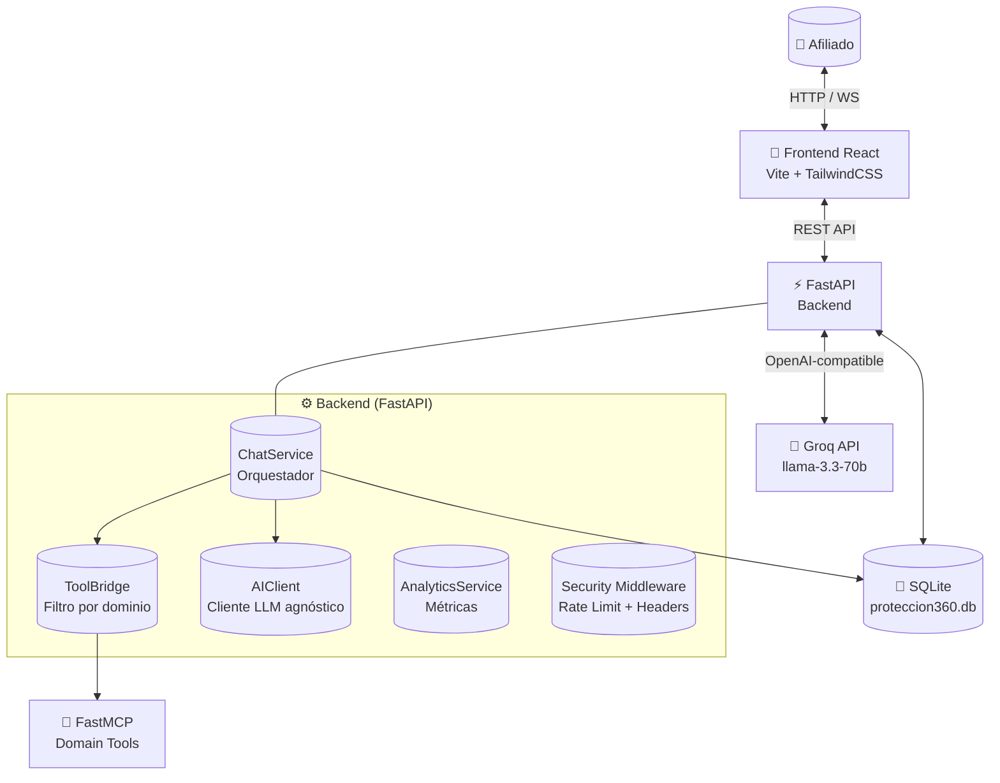
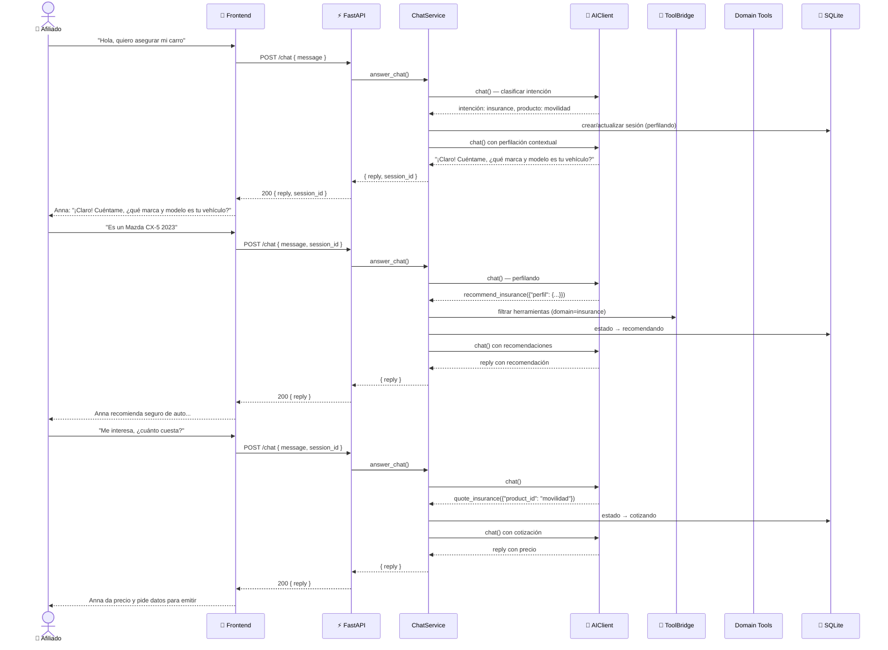
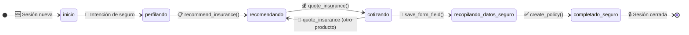

# 🛡️ Protección Inteligente 360°

<p align="center">
  <b>Asistente conversacional de seguros potenciado por IA — Colsubsidio</b>
  <br>
  <i>「 Anna, tu asesora experta en seguros 」</i>
</p>

<div style="display: flex; flex-wrap: wrap; justify-content: center; gap: 4px;">
  
  
  
  
  
  
  
  
  
  
  
</div>

<p align="center">
  <b>🚫 Solo seguros.</b> Este sistema no gestiona créditos. Dominio exclusivo de protección:
  🚗 Vida · 🏠 Hogar · 🐾 Mascotas · ✈️ Viajes · ⚠️ Accidentes
</p>


---

## 🏗️ Arquitectura

### Visión General



### 🗺️ Flujo de una Conversación



---

## 🔄 Máquina de Estados

Cada sesión de chat navega por estos estados del dominio **seguros**:



| Estado | Icono | Descripción |
|--------|:-----:|-------------|
| `inicio` | 🆕 | Sesión creada, sin intención detectada aún |
| `perfilando` | 🎯 | Detectando producto y recabando perfil contextual del afiliado |
| `recomendando` | 📋 | Generando y presentando recomendaciones de producto |
| `cotizando` | 💰 | Calculando precio y condiciones de la póliza |
| `recopilando_datos_seguro` | 📝 | Recolectando datos para emitir la póliza |
| `completado_seguro` | ✅ | Póliza emitida, sesión finalizada |

---

## 🎯 Perfilación Contextual

Anna detecta **automáticamente** el producto desde el **primer mensaje** del usuario y adapta sus preguntas de perfilación. No pregunta genéricas — va directo al grano:

| Producto | Palabras clave | 🙋 Preguntas contextuales |
|:--------:|----------------|---------------------------|
| 🚗 **Movilidad** | carro, vehículo, auto, moto, camioneta | Marca, modelo, año, uso particular o comercial |
| ❤️ **Vida** | vida, fallecimiento, deceso, beneficiarios | Edad, ocupación, beneficiarios, condiciones preexistentes |
| 🏠 **Hogar** | casa, hogar, apartamento, vivienda, incendio | Tipo, estrato, área construida, antigüedad |
| 🐾 **Mascotas** | mascota, perro, gato | Especie, raza, edad, condiciones médicas |
| ✈️ **Viajes** | viaje, viajar, vacaciones | Destino, duración, tipo de cobertura |
| ⚠️ **Accidentes** | accidentes, accidente personal, incapacidad | Edad, ocupación, actividades de riesgo |
| ❓ **Genérico** | *(sin palabra clave)* | Preguntas generales: edad, qué proteger |

> 💡 **Ejemplo real:** Si el usuario dice *"quiero asegurar mi vehículo"*, Anna **NO** pregunta por hijos, estado civil o tipo de vivienda. Pregunta directo: marca, modelo y año del vehículo.

---

## 🚀 Instalación

### 📦 Requisitos

| Recurso | Versión | Comando |
|---------|:-------:|---------|
| 🐳 Docker Engine | >= 24 | *(recomendado)* |
| 🐳 Docker Compose | v2 | `docker compose version` |
| 🐍 Python | 3.12+ | `python --version` |
| 📦 pnpm | 9 | `corepack enable && corepack prepare pnpm@9.15.4 --activate` |

### 🔑 Variables de Entorno

```bash
cp backend/.env.example backend/.env
# ✏️ Edita backend/.env y pon tu LLM_API_KEY de Groq
```

| Variable | ¿Obligatoria? | Defecto | Descripción |
|----------|:-------------:|:-------:|-------------|
| `LLM_API_KEY` | ✅ Sí | — | 🔑 API key de Groq (gsk_...) |
| `LLM_MODEL` | ❌ No | `llama-3.3-70b-versatile` | 🧠 Modelo LLM |
| `LLM_BASE_URL` | ❌ No | `https://api.groq.com/openai/v1` | 🔗 Endpoint del provider |
| `DATABASE_URL` | ❌ No | `sqlite+aiosqlite:///data/...` | 💾 Conexión a base de datos |
| `ENVIRONMENT` | ❌ No | `development` | 🌍 `development` o `production` |
| `DEBUG` | ❌ No | `true` | 🔍 Modo debug (echo SQL) |

> 🔌 **Provider-agnóstico:** Funciona con **cualquier** proveedor OpenAI-compatible. Solo cambia 3 vars:
> ```bash
> # Groq (default)    → LLM_API_KEY=gsk_...   + LLM_BASE_URL=https://api.groq.com/openai/v1
> # OpenAI            → LLM_API_KEY=sk-...    + LLM_BASE_URL=https://api.openai.com/v1
> # Ollama (local)    → LLM_API_KEY=ollama    + LLM_BASE_URL=http://localhost:11434/v1
> ```

### 🐳 Con Docker (recomendado)

```bash
git clone <repo> && cd Reto30X_Credit
cp backend/.env.example backend/.env   # ✏️ Pon tu API key
make dev
```

| Servicio | URL |
|----------|:---:|
| ⚡ Backend (FastAPI) | http://localhost:8000 |
| ❤️ Health check | http://localhost:8000/health |
| 🧩 Frontend (Vite) | http://localhost:5173 |
| 📖 API Docs (Swagger) | http://localhost:8000/docs |

### 💻 Sin Docker (desarrollo local)

```bash
# Terminal 1 — Backend
cd backend
python -m venv .venv && source .venv/bin/activate
pip install -r requirements.txt
uvicorn app.main:app --reload

# Terminal 2 — Frontend
cd frontend
pnpm install
pnpm dev
```

---

## 📁 Estructura del Proyecto

```
📦 Reto30X_Credit/
├── 🐍 backend/
│   ├── ⚙️ app/
│   │   ├── 🚀 main.py                  # Factory create_app() + lifespan
│   │   ├── ⚙️ config.py                # Pydantic Settings
│   │   ├── 🗄️ database.py              # Engine asíncrono + session factory
│   │   ├── 🧠 ai/
│   │   │   └── client.py               # AIClient — wrapper OpenAI-compatible
│   │   ├── 📝 domain/
│   │   │   └── prompts/
│   │   │       └── insurance_system.md  # Prompt de cierre/recomendación
│   │   ├── 🛡️ middleware/
│   │   │   └── security.py             # Rate limiting + security headers
│   │   ├── 🗃️ models/                  # ORM: SQLAlchemy 2.0 (14 modelos)
│   │   │   ├── session.py              # Sesiones de chat
│   │   │   ├── customer.py             # Afiliados/Clientes
│   │   │   ├── insurance.py            # Pólizas de seguro
│   │   │   ├── policy.py               # Documentos de póliza
│   │   │   ├── product.py              # Catálogo de productos
│   │   │   ├── conversation.py         # Historial de mensajes
│   │   │   └── ...                     # claim, credit, application, etc.
│   │   ├── 📡 routers/
│   │   │   ├── health.py               # GET /health
│   │   │   ├── chat.py                 # POST /chat
│   │   │   └── analytics.py            # GET /analytics/*
│   │   ├── 📐 schemas/
│   │   │   ├── insurance_schema.py     # InsuranceFormSchema + variantes
│   │   │   └── credit_form.py          # FormSchema (legacy)
│   │   ├── 🔧 services/
│   │   │   ├── chat.py                 # ⭐ ChatService — orquestador central
│   │   │   ├── tool_bridge.py          # ToolBridge — filtro por dominio
│   │   │   ├── recommendation_engine.py# Motor de recomendaciones
│   │   │   └── analytics.py            # AnalyticsService — dashboard
│   │   └── 🛠️ tools/
│   │       ├── mcp_server.py           # FastMCP("Proteccion360")
│   │       └── domain_tools.py         # Herramientas MCP de seguros
│   ├── 🧪 tests/                       # 13 archivos, 33+ tests
│   ├── 💾 data/                        # Base de datos SQLite
│   ├── 🔑 .env                         # Variables de entorno
│   ├── 🐳 Dockerfile
│   ├── 📦 requirements.txt
│   └── 📋 pyproject.toml
│
├── 🎨 frontend/
│   ├── 📁 src/
│   │   ├── 📄 App.tsx
│   │   ├── 🧩 components/
│   │   │   ├── 💬 chat/
│   │   │   │   └── ChatPanel.tsx       # Panel de chat principal
│   │   │   └── 📊 dashboard/
│   │   │       ├── DashboardLayout.tsx
│   │   │       ├── InsurancePanel.tsx
│   │   │       ├── CustomerPanel.tsx
│   │   │       ├── PipelinePanel.tsx
│   │   │       ├── TrendsPanel.tsx
│   │   │       └── EfficiencyPanel.tsx
│   │   ├── 🎨 theme/
│   │   └── 📚 lib/
│   ├── 🐳 Dockerfile
│   └── ⚡ vite.config.ts
│
├── 🐳 docker-compose.yml
├── 📜 Makefile
└── 📖 README.md
```

---

## 📡 API Endpoints

| Método | 🔗 Ruta | 📝 Descripción | 🎯 Uso |
|:------:|:--------|:---------------|:-------|
| <span style="color:green">**GET**</span> | `/health` | Health check + uptime + versión | ❤️ Monitoreo |
| <span style="color:orange">**POST**</span> | `/chat` | Enviar mensaje a Anna | 💬 Chat |
| <span style="color:green">**GET**</span> | `/analytics/summary` | Resumen de métricas | 📊 Dashboard |
| <span style="color:green">**GET**</span> | `/analytics/customers` | Datos de afiliados | 👥 Dashboard |
| <span style="color:green">**GET**</span> | `/analytics/pipeline` | Pipeline de ventas | 📈 Dashboard |
| <span style="color:green">**GET**</span> | `/analytics/insurance` | Métricas de pólizas | 🛡️ Dashboard |
| <span style="color:green">**GET**</span> | `/analytics/trends` | Tendencias | 📉 Dashboard |
| <span style="color:green">**GET**</span> | `/analytics/efficiency` | Eficiencia operativa | ⚡ Dashboard |

### 💬 POST /chat

```json
{
  "message": "Quiero asegurar mi moto"
}
```

**✨ Respuesta:**

```json
{
  "reply": "¡Claro! Cuéntame, ¿qué marca y modelo es tu moto?",
  "session_id": "550e8400-e29b-41d4-a716-446655440000",
  "intent": "insurance",
  "product_context": "movilidad"
}
```

> 💡 **Tip:** Si no envías `session_id`, Anna crea una sesión nueva automáticamente.

---

## 🧪 Testing

```bash
cd backend

# 🚀 Todo el suite (33+ tests)
python -m pytest

# 📊 Con cobertura
python -m pytest --cov=app --cov-report=term-missing

# 🎯 Archivo específico
python -m pytest tests/test_chat.py -v

# ⏱️ Asíncronos
python -m pytest -p no:asyncio --asyncio-mode=auto
```

### 📋 Tests incluidos

| Archivo | 🔬 Prueba |
|:--------|:----------|
| `test_chat.py` | ⭐ ChatService, máquina de estados, perfilación contextual, tool bridge, system prompt |
| `test_insurance_flow.py` | 🛡️ Flujo completo de emisión de seguro |
| `test_tool_bridge.py` | 🔌 Filtrado de herramientas MCP por dominio |
| `test_domain_tools.py` | 🛠️ Herramientas MCP de seguros |
| `test_insurance_schema.py` | 📐 Schema y validación de campos del formulario |
| `test_recommendation_engine.py` | 📋 Motor de recomendaciones de productos |
| `test_analytics.py` | 📊 AnalyticsService |
| `test_routers.py` | 🌐 Endpoints HTTP |
| `test_security.py` | 🛡️ Middleware de seguridad |
| `test_credit_form.py` | 📋 Schema de crédito *(legacy)* |
| `test_interest_rate.py` | 💰 Tasas de interés *(legacy)* |

---

## 📜 Makefile

| Target | ⚙️ Comando | 📝 Descripción |
|:-------|:----------:|:---------------|
| `make dev` | `docker compose up --build` | 🚀 Construye e inicia backend + frontend |
| `make backend` | `docker compose up --build backend` | ⚡ Inicia solo el backend |
| `make frontend` | `docker compose up --build frontend` | 🎨 Inicia solo el frontend |
| `make build` | `docker compose build` | 🐳 Construye todas las imágenes Docker |
| `make shell` | `docker compose exec backend python` | 💻 Shell interactivo de Python |
| `make clean` | `docker compose down -v` | 🧹 Detiene contenedores y borra volúmenes |

---

## 💻 Desarrollo

### 🔥 Hot Reload

- **⚡ Backend:** uvicorn `--reload` — detecta cambios en `*.py` al instante
- **⚡ Frontend:** Vite HMR — actualiza el navegador sin recargar la página

### ➕ Agregar un Nuevo Producto de Seguro

1. 🏷️ Agregar ID + nombre en `recommendation_engine.py` (`PRODUCTOS`)
2. 📐 Agregar variante en `insurance_schema.py` → `InsuranceFormSchema.product_variants`
3. 🔍 Agregar keywords en `chat.py` → `_detect_product_context()`
4. 🙋 Agregar preguntas en `chat.py` → `_build_profiling_instructions()`

### 🔄 Cambiar de Proveedor LLM

El sistema usa el SDK de OpenAI, así que funciona con **cualquier** proveedor compatible:

```bash
# 🟢 Groq (default) — GRATIS
LLM_API_KEY=gsk_...
LLM_BASE_URL=https://api.groq.com/openai/v1
LLM_MODEL=llama-3.3-70b-versatile

# 🔵 OpenAI
LLM_API_KEY=sk-...
LLM_BASE_URL=https://api.openai.com/v1
LLM_MODEL=gpt-4o

# 🟡 SiliconFlow
LLM_API_KEY=sk-...
LLM_BASE_URL=https://api.siliconflow.cn/v1
LLM_MODEL=Qwen/Qwen2-7B-Instruct

# 🟣 Local (Ollama)
LLM_API_KEY=ollama
LLM_BASE_URL=http://localhost:11434/v1
LLM_MODEL=llama3.1
```

---

## 📄 Licencia

**Colsubsidio** — Uso interno. Distribución no autorizada.

---
